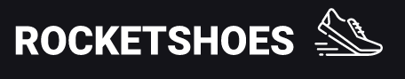
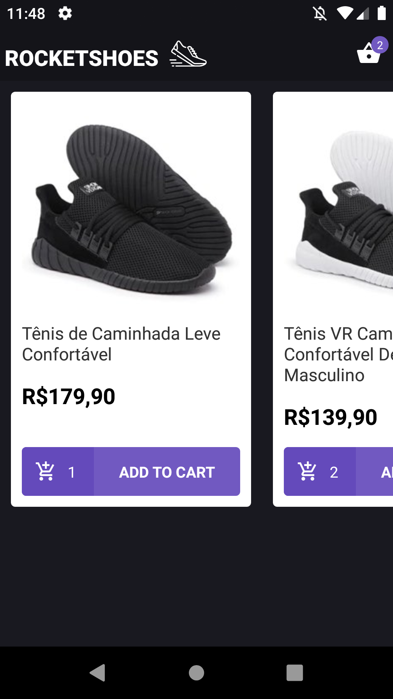
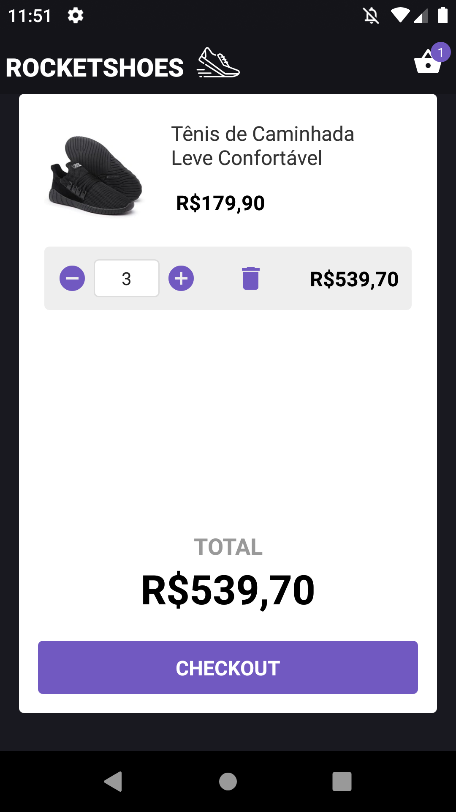

<h1 align="center">
   
</h1>
:us: 
 
Mobile app (android and iOS) to simulate shoes ecommerce in two screens: Home and Cart. Developed during <a href="https://rocketseat.com.br/gostack">GoStack10 bootcamp</a> seventh challange.
This challange basically consisted in transform the <a href="https://github.com/gabrielbarth/web-rocketshoes">web app</a> to react native app.  
This challange allowed clarify many concepts about flux architecture, especially still using class components and also without the usage of react hooks.

**[UPDATING TO CHALLANGE 08]:** From the commit <a href="https://github.com/gabrielbarth/rocketShoesApp/commit/96d1c2c36e9192122e65e9a07aea23ef6fc77da4">refactoring components to react-hooks</a> this app started to use react-hooks.

 
&#x1f1e7;&#x1f1f7;
 
Aplicativo mobile para simular um ecommerce de tênis em duas telas: Home e Carrinho. Desenvolvido durante o desafio 07 do <a href="https://rocketseat.com.br/gostack">bootcamp GoStack10</a>.
Este desafio consistiu basicamente em transformar a <a href="https://github.com/gabrielbarth/web-rocketshoes">aplicação web</a> que foi desenvolvida em aplicativo react-native.

O desenvolvimento desse app permitiu esclarecer muitos conceitos sobre a arquitetura flux, sobretudo ainda utilizando componentes de classe e também sem a utilização dos react hooks. 

**[ATUALIZAÇÃO DO DESAFIO 08]:** A partir do commit <a href="https://github.com/gabrielbarth/rocketShoesApp/commit/96d1c2c36e9192122e65e9a07aea23ef6fc77da4">refactoring components to react-hooks</a> este app passou a usar react-hooks.

##  :mag_right: Main points covered on project / Principais pontos
:us: 
- We styled the application with styled-components, which facilitates and centralizes the styling of the app's components;
- We use JSON-SERVER to simulate data from an API and provide the necessary information;
- We use Redux to manipulate the global states of the application;
- We also use Redux-saga, which allowed us to verify certain information before actually making changes to the store (global state of the application)
- We connected the application with reactotron, which allowed us to follow the flow of information through the application, basically: COMPONENT -> ACTION -> REDUCER (STORE CHANGE) -> REDUX NOTIFY ALL COMPONENTS ABOUT THAT UPDATE AND WHICH IS WAITING FOR THE NOTICE IT IS RENDERED / UPDATED.
 

&#x1f1e7;&#x1f1f7;
- Estilizamos a aplicação com styled-componentes, o que facilita e centraliza a estilização dos componentes do app;
- Utilizamos JSON-SERVER para simular dados de uma API e fornecer as informações necessárias;
- Utilizamos o Redux, para manipulação dos estados globais da aplicação;
- Tamém usamos o Redux-saga, que permitiu verificar determinadas informações antes de factualmente realizar mudanças no store (estado global da aplicação);
- Conectamos a aplicação com o reactotron, que nos permitiu acompanhar o fluxo de informações pela aplicação, basicamente: COMPONENTE -> ACTION -> REDUCER (ALTERAÇÃO DA STORE) -> REDUX INFORMA TODOS OS COMPONENTES SOBRE A ATUALIZAÇÃO E, O COMPONENTE QUE ESTIVER AGUARDANDO ESSA ATUALIZAÇÃO É RENDERIZADO/ATUALIZADO. 
 

##  :computer: View of interface / Visão da interface

  
  
  
  

 

##  :link: Project dependencies / Bibliotecas utilizadas

:ballot_box_with_check: **<a href="https://pt-br.reactjs.org/">react</a>**   `// react lib`  
:ballot_box_with_check: **<a href="https://reactnavigation.org/docs/getting-started">@react-navigation/native (v5)</a>**     `// allows outing and navigation RN apps - version 5`  
:ballot_box_with_check: **<a href="https://github.com/lucasferreira/react-native-flash-message">react-native-flash-message</a>**     `// easily and highly customizable flashbars, top notifications or alerts `  
:ballot_box_with_check: **<a href="https://github.com/oblador/react-native-vector-icons">react-native-vector-icons</a>**      `// allows to use icons from several libs`   
:ballot_box_with_check: **<a href="https://github.com/axios/axios">axios</a>**   `// Promise based HTTP client for the browser and node.js`   
:ballot_box_with_check: **<a href="https://styled-components.com/">styled-components</a>**   `// allows to write actual CSS code to style components`   
:ballot_box_with_check: **<a href="https://www.npmjs.com/package/prop-types">prop-types</a>**  `// used to document the intended types of properties passed to components`   
:ballot_box_with_check: **<a href="https://redux.js.org/">redux</a>**    `// allows manage app global state `   
:ballot_box_with_check: **<a href="https://github.com/redux-saga/redux-saga">redux-saga</a>**   `// allows manage app global state using middlewares (each other things) `   
:ballot_box_with_check: **<a href="https://github.com/infinitered/reactotron">reactotron-react-js</a>**   `// desktop app for inspecting informations through the app`   
:ballot_box_with_check: **<a href="https://github.com/infinitered/reactotron/blob/master/docs/plugin-redux.md">reactotron-redux</a>**            `// allow us observing using of middlewares in API requests `   
:ballot_box_with_check: **<a href="https://www.npmjs.com/package/react-dom">react-dom</a>**    `// allows to load react through <script> tag `  
:ballot_box_with_check: **<a href="https://www.npmjs.com/package/react-router-dom">react-router-dom</a>**      `// DOM bindings for React Router `  
:ballot_box_with_check: **<a href="https://github.com/immerjs/immer">immer</a>**    `// allows create the next immutable state by mutating the current one`  
:ballot_box_with_check: **<a href="https://polished.js.org/"> polished </a>**    `// a lightweight toolset for writing styles in JavaScript`  
:ballot_box_with_check: **<a href="https://github.com/ReactTraining/history"> history </a>**     `// allows manage session history with JavaScript`  
:ballot_box_with_check: **<a href="https://developer.mozilla.org/pt-BR/docs/Web/JavaScript/Reference/Global_Objects/Intl">Intl</a>**     `// common features to internationalization builders and other functions included in JS`  

**Development libs / Bibliotecas de desenvolvimento utilizadas no projeto:**
 
:ballot_box_with_check: **<a href="https://eslint.org/">eslint</a>**    `// finds and fixes code errors` 
 
:ballot_box_with_check: **<a href="https://prettier.io/">prettier</a>**  `// makes code prettier` 
 

<h1 align="center">
    
</h1>

<h3 align="center">
  Desafio 7: Arquitetura Flux
</h3>

<blockquote align="center">“Não espere resultados brilhantes se suas metas não forem claras”!</blockquote>

  

  

  

  

  <a href="#rocket-sobre-o-desafio">Sobre o desafio</a>&nbsp;&nbsp;&nbsp;|&nbsp;&nbsp;&nbsp;
  <a href="#-entrega">Entrega</a>&nbsp;&nbsp;&nbsp;|&nbsp;&nbsp;&nbsp;
  <a href="#memo-licença">Licença</a>

## :rocket: Sobre o desafio

Nesse desafio você migrará o projeto de e-commerce criado na web para dispositivos móveis utilizando React Native. O projeto terá as mesmas funcionalidades que o projeto web mas deve possuir uma interface mobile.

### Um pouco sobre as ferramentas

Utilize ESLint, Prettier, EditorConfig, React Navigation e todas outras ferramentas que vimos até aqui no mundo do React Native.

### Layout

O layout do projeto está em anexo com esse desafio. O arquivo `.sketch` (no diretório `.github`) pode ser aberto no <a href="https://www.figma.com/file/DekiZvcD3T1zHQUHwGDqHD/layout?node-id=0%3A202">Figma,</a> que é uma ferramenta de prototipação online.

<h3 align="center">
  Desafio 8: Utilizando React Hooks
</h3>

<blockquote align="center">“Não existe linha de chegada, a vitória está em se manter correndo”!</blockquote>

  

  

  

  

  <a href="#rocket-sobre-o-desafio">Sobre o desafio</a>&nbsp;&nbsp;&nbsp;|&nbsp;&nbsp;&nbsp;
  <a href="#-entrega">Entrega</a>&nbsp;&nbsp;&nbsp;|&nbsp;&nbsp;&nbsp;
  <a href="#memo-licença">Licença</a>

## :rocket: Sobre o desafio

Nesse desafio você deve converter a aplicação que você desenvolveu no desafio do módulo anterior para utilização de React Hooks.

## 📅 Entrega

Esse desafio **não precisa ser entregue** e não receberá correção, mas você pode ver o resultado do [código do desafio aqui](https://github.com/Rocketseat/bootcamp-gostack-desafio-08). Após concluir o desafio, adicionar esse código ao seu Github é uma boa forma de demonstrar seus conhecimentos para oportunidades futuras.

## :memo: Licença

Esse projeto está sob a licença MIT. Veja o arquivo [LICENSE](LICENSE.md) para mais detalhes.

---

Feito com ♥ by Rocketseat :wave: [Entre na nossa comunidade!](https://discordapp.com/invite/gCRAFhc)
